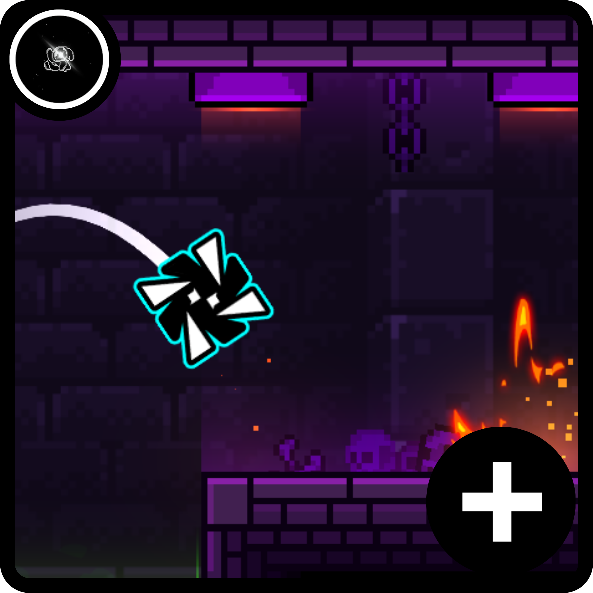

# CustomPlatControl

Make Platformer controls feel the way you want.

CustomPlatControl lets you remap left, jump, and right for both players in Platformer levels.

## Why use it?

- Full control remapping for Platformer mode.
- Different controls for Player 1 and Player 2.
- Works with Geode settings, so your binds are saved.
- Classic mode controls stay exactly the same.

## Default controls

- Player 1: `A` (Left), `W` (Jump), `D` (Right)
- Player 2: `ArrowLeft` (Left), `ArrowUp` (Jump), `ArrowRight` (Right)

## Compatibility

- Geode: `5.0.0-beta.2` (and later)
- GD: `2.2081`
- Mod ID: `crystaldust.customplatcontrol`

## How to use

1. Open Geode mod settings for **CustomPlatControl**.
2. Set your keys for Player 1 and Player 2.
3. Start a Platformer level and play.

## Notes

- This mod focuses on keyboard remapping in Platformer mode.
- If you bind the same key to multiple actions, those actions trigger together.
